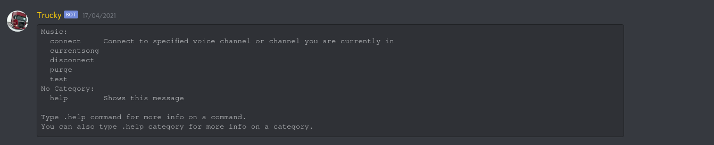
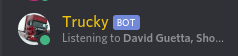
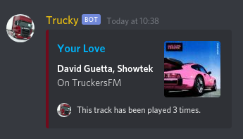

<h1>TruckyBot</h1>

  Truckybot is a 'simple' Discord bot made in Python.
  All this bot does is:
  <ul>
    <li>Play an audio stream in voice channels</li>
    <li>Show upcoming anime/manga, based on given arguments</li>
    <li>Post the latest Steam news of certain games, automatically checking every hour (needs to be initiated)</li>
    <li>Display the song currently playing in the audio stream (<a href="http://truckers.fm">TruckerFM</a>)</li>
    <li>Clean/Purge messages from a text channel</li>
  </ul>

<h3>Some screenshots</h3>

